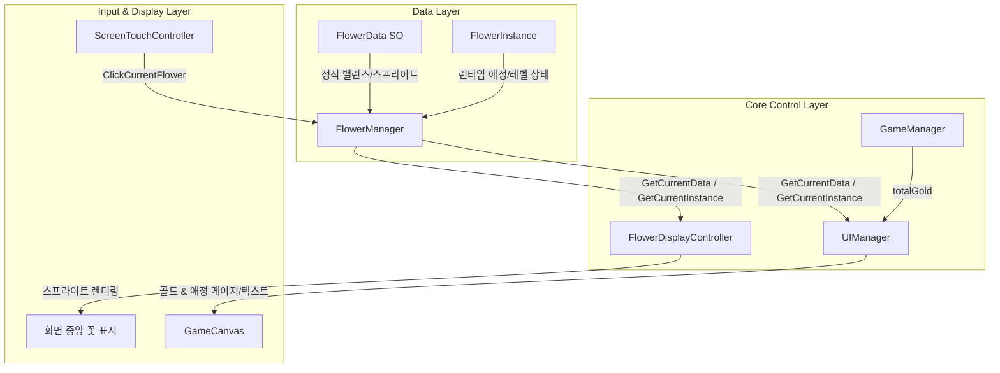
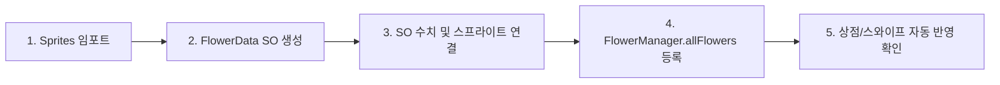

# 🌸 Moe Moe Flower — 프로젝트 유지보수 및 개발자 가이드 (PROJECT MAINTENANCE GUIDE)

> **문서 버전:** 1.0.0  
> **최종 수정일:** 2026-08-24  
> **대상:** 프로젝트에 새로 참여하거나 장기 유지보수 및 확장 개발을 진행하는 모든 개발자  

---

## 1. 프로젝트 개요

**Moe Moe Flower**는 꽃을 키우고 애정을 쏟아 개화시키며, 골드를 생산하고 다양한 꽃소녀들을 수집하는 **모바일 세로형 기본 방치형/클리커 게임**입니다.

### 핵심 설계 철학
1. **데이터 중심 설계 (Data-Driven Architecture)**: 새로운 꽃, 아이템, 밸런스 변경 시 C# 코드 수정 없이 ScriptableObject(SO)와 프리팹 조작만으로 확장이 가능해야 함.
2. **기능과 위치의 완벽 분리 (Decoupled UI & Position)**: UI 패널(상점, 꽃 관리, 도감 등)은 자신이 배치될 슬롯의 위치를 소스코드 수준에서 가정하거나 참조하지 않아야 함.
3. **모바일 세로 화면 기준 PC 가로 확장 (Mobile First + PC Expansion)**: 게임 본체는 항상 9:16 비율의 중앙 세로 모바일 화면이며, PC 화면에서는 좌우 사이드바 패널이 가득 채워지는 3열 레이아웃 구조를 가짐.

---

## 2. 프로젝트 폴더 및 에셋 구조

실제 `Assets/` 디렉터리 내의 디렉터리 및 에셋 구성은 다음과 같습니다.

```text
Assets/
├─ Project/                                      # 프로젝트 메인 자원
│  ├─ Prefabs/
│  │  └─ ShopItem.prefab                        # 상점 항목 카드 UI 프리팹 (LayoutElement 90px 포함)
│  ├─ Scenes/
│  │  └─ SampleScene.unity                      # 메인 게임 씬
│  ├─ ScriptableObjects/
│  │  └─ (데이터 에셋 저장소)
│  ├─ Scripts/
│  │  ├─ Core/
│  │  │  ├─ GameManager.cs                      # 싱글톤: 골드/터치/애정 전역 수치 관리
│  │  │  ├─ Flowermanager.cs                    # 싱글톤: 보유 꽃 목록, 골드 생산 및 스와이프 관리
│  │  │  ├─ FlowerDisplayController.cs          # 화면 중앙 현재 꽃 스프라이트 렌더링 및 폴링
│  │  │  └─ FlowerController.cs                # [DEPRECATED] 레거시 1꽃=1오브젝트 스크립트 (사용 안함)
│  │  ├─ Data/
│  │  │  ├─ FlowerData.cs                       # ScriptableObject 클래스 (꽃의 정적 밸런스/스프라이트)
│  │  │  └─ FlowerInstance.cs                   # 런타임 동적 상태 데이터 (애정, 레벨, 개화 여부)
│  │  ├─ Input/
│  │  │  └─ ScreenTouchController.cs            # InputSystem 기반 전역 클릭/터치 입력 전송
│  │  ├─ UI/
│  │  │  ├─ Uimanager.cs                        # 매 프레임 UI(골드, 애정, 게이지) 갱신 폴링
│  │  │  ├─ ShopManager.cs                      # allFlowers 순회 기반 ShopItem 자동 생성
│  │  │  ├─ ShopItem.cs                         # 상점 항목 UI 바인딩 및 구매 클릭 전달
│  │  │  └─ PCLayoutController.cs               # PC/모바일 사이드바 활성화 및 패널 슬롯 제어
│  │  ├─ Editor/
│  │  │  └─ PCLayoutBuilder.cs                  # [Tools > 🌸 Build PC Layout] 자동 UI 씬 리빌더
│  │  ├─ Save/                                  # (향후 저장/불러오기 시스템 저장소)
│  │  └─ ScriptableObjects/
│  │     └─ FlowerGirl/
│  │        └─ Flower Data/                     # 실제 꽃 SO 에셋 저장소 (.asset)
│  │           └─ Flower_Dandelion.asset        # 민들레 데이터 에셋
│  └─ Sprites/
│     ├─ Flowers/
│     │  └─ Dandelion/                          # 단계별 스프라이트 (Seed, Sprout, Growing, Bloom)
│     └─ UI/                                    # UI용 그래픽 자원
└─ TextMesh Pro/                                # 한글 폰트 에셋 (NotoSansKR-Bold SDF 적용)
```

---

## 3. 핵심 시스템 구조 및 클래스 명세

### 1) `FlowerData.cs` (`Assets/Project/Scripts/Data/FlowerData.cs`)
* **담당 역할**: 특정 꽃 종의 정적(Static) 데이터 정의 (ScriptableObject).
* **주요 필드**:
  - `flowerId` (string): 고유 식별자 (예: `"dandelion"`)
  - `displayName` (string): 표기 한글 이름 (예: `"민들레"`)
  - `requiredAffection` (int): 개화에 필요한 총 애정 수치
  - `seedPrice` (double): 씨앗 구매 비용
  - `baseGoldPerSecond` (float): 개화 후 Lv.1 초당 골드 생산량
  - `levelUpBaseCost`, `levelUpGrowthRate`: 레벨업 비용 수치
  - `seedSprite`, `sproutSprite`, `growingSprite`, `bloomSprite`: 4단계 성장 스프라이트
* **주의**: 게임 런타임 중에 `FlowerData`에 저장된 수치를 직접 수정하지 말 것 (SO가 수정되어 저장될 수 있음).

### 2) `FlowerInstance.cs` (`Assets/Project/Scripts/Data/FlowerInstance.cs`)
* **담당 역할**: 플레이어가 보유한 특정 꽃의 런타임 동적(Dynamic) 진행 상태 저장.
* **주요 필드**: `flowerId`, `currentAffection`, `isBloomed`, `currentLevel`.
* **주요 메소드**: `GetGrowthStage(requiredAffection)` (현재 성장 단계 계산), `GetGrowthPercent()` (애정 달성 비율 0.0~1.0).

### 3) `FlowerManager.cs` (`Assets/Project/Scripts/Core/Flowermanager.cs`)
* **담당 역할**: 게임에 존재하는 전체 꽃 목록(`allFlowers`)과 플레이어가 구매한 꽃(`ownedFlowers`)을 총괄 관리하는 중앙 싱글톤.
* **핵심 기능**:
  - 매 프레임(`Update`) 보유 중인 개화된 모든 꽃의 골드 생산 수치를 계산하여 `GameManager.Instance.AddGold()` 호출.
  - 씨앗 구매(`TryPurchaseSeed`), 화면 표시 전환(`SwipeNext`, `SwipePrevious`, `TryJumpTo`).
  - 클릭 수신시 현재 꽃에 애정 누적 (`ClickCurrentFlower`).
* **수정 금지**: `allFlowers` 순서가 도감 및 스와이프 순서의 기준이 되므로 런타임 중 순서를 함부로 섞지 말 것.

### 4) `FlowerDisplayController.cs` (`Assets/Project/Scripts/Core/FlowerDisplayController.cs`)
* **담당 역할**: 화면 중앙 모바일 영역에 현재 선택된 꽃의 스프라이트를 렌더링하고 클릭 입력을 수신.
* **특징**: `FlowerManager`의 데이터를 매 프레임 폴링하여 꽃 변경 및 성장 단계 변화 시 스프라이트를 자동 교체.
* **Placeholder 기능**: `FlowerData`에 스프라이트 에셋이 비어있는 제작 극초기 단계라도 성장 단계별 임시 컬러 사각형을 자동 생성하여 렌더링함.

### 5) `GameManager.cs` (`Assets/Project/Scripts/Core/GameManager.cs`)
* **담당 역할**: 전체 플레이어 골드(`totalGold`), 기본 클릭 터치 골드량(`touchGoldAmount`), 기본 클릭 터치 애정량(`touchAffectionAmount`) 관리.

### 6) `ShopManager.cs` (`Assets/Project/Scripts/UI/ShopManager.cs`)
* **담당 역할**: `FlowerManager.Instance.allFlowers`를 순회하여 `Content` RectTransform 하위에 `ShopItem.prefab`을 자동 생성 및 데이터 바인딩.
* **특징**: 데이터 기반으로 자동 생성되므로, **새로운 꽃이 추가되어도 이 스크립트는 0줄도 수정할 필요가 없음**.

### 7) `ShopItem.cs` (`Assets/Project/Scripts/UI/ShopItem.cs`)
* **담당 역할**: 상점 항목 카드 단일 객체의 UI(꽃 이름, 가격, 구매 버튼 상태) 제어.
* **특징**: `flowerNameText`("민들레"), `priceText`("무료" 또는 "360 G")를 표시하며 이미 보유한 꽃은 구매 버튼을 `이미 보유중` 비활성 상태로 전환.

### 8) `UIManager.cs` (`Assets/Project/Scripts/UI/Uimanager.cs`)
* **담당 역할**: 메인 UI 오버레이 (상단 골드 및 초당 생산량, 하단 현재 꽃 애정 게이지 및 수치)를 매 프레임 폴링 갱신.
* **특징**: `rateSmoothingTime` 스무딩을 적용하여 1초당 실제 변화 수치를 부드럽게 텍스트로 표기.

### 9) `ScreenTouchController.cs` (`Assets/Project/Scripts/Input/ScreenTouchController.cs`)
* **담당 역할**: Unity `InputSystem`을 기반으로 PC 좌클릭 및 모바일 터치를 감지하여 `FlowerManager.Instance.ClickCurrentFlower()`로 전송.

### 10) `PCLayoutController.cs` (`Assets/Project/Scripts/UI/PCLayoutController.cs`)
* **담당 역할**: PC 3열 화면과 모바일 단일 화면 모드 전환 제어 및 사이드바 토글.
* **특징**: 런타임 오브젝트 이동(Reparenting)을 배제하고, Unity Hierarchy 상에서 원하는 슬롯 자식으로 드래그 배치된 패널을 Inspector 레벨에서 참조하여 제어.

### 11) `PCLayoutBuilder.cs` (`Assets/Project/Scripts/Editor/PCLayoutBuilder.cs`)
* **담당 역할**: 유니티 에디터 상단 메뉴 `Tools` > `🌸 Build PC Layout` 클릭 시, 씬 내부 UI를 100% 자동 재구성하고 오프셋 버그 및 구형 요소를 클리닝하는 빌드 자동화 스크립트.

---

## 4. 핵심 데이터 및 이벤트 흐름



### 1) 클릭(터치) 시 런타임 흐름
```text
[ScreenTouchController] (터치/마우스 감지)
       ↓
[FlowerManager.ClickCurrentFlower()]
       ├─→ GameManager.AddGold(touchGoldAmount)  (골드 증가)
       └─→ AddAffection(currentDisplayedFlower, touchAffectionAmount) (애정 증가)
              ↓
[UIManager.Update()] (폴링) ──→ GoldText / AffectionBar / AffectionValueText 갱신
```

### 2) 개화(Bloom) 런타임 흐름
```text
애정 수치 >= requiredAffection 달성
       ↓
FlowerInstance.isBloomed = true, currentLevel = 1
       ↓
FlowerManager.OnFlowerBloomed 이벤트 발행
       ↓
FlowerDisplayController가 GrowthStage.Bloomed 감지 ──→ bloomSprite 로 변경
       ↓
FlowerManager.Update() ──→ 개화된 모든 꽃의 baseGoldPerSecond 자동 합산 및 GameManager.AddGold() 지속 호출
```

---

## 5. 새로운 꽃 추가 가이드 (Checklist)

새로운 꽃(예: **라벤더 / Lavender**)을 프로젝트에 추가할 때 다음 체크리스트를 따라 순서대로 진행합니다.



### 상세 단계 안내

#### A. 스프라이트 준비
`Assets/Project/Sprites/Flowers/Lavender/` 폴더를 생성하고 4개 단계 이미지를 넣습니다:
- `Seed.png` (씨앗)
- `Sprout.png` (새싹)
- `Growing.png` (성장 중)
- `Bloom.png` (개화)

#### B. `FlowerData` 에셋 생성
1. Unity Project 창에서 `Assets/Project/Scripts/ScriptableObjects/FlowerGirl/Flower Data/` 폴더 우클릭.
2. `Create` > `Flower Data` 선택 후 이름을 `Flower_Lavender.asset`으로 변경.
3. Inspector 창에서 수치 입력:
   - **`flowerId`**: `"lavender"` (소문자 영문 고유 키)
   - **`displayName`**: `"라벤더"` (한글 표시 이름)
   - **`requiredAffection`**: `200`
   - **`seedPrice`**: `500`
   - **`baseGoldPerSecond`**: `15`
   - **`levelUpBaseCost`**: `100`, **`levelUpGrowthRate`**: `1.15`
   - **`goldPerSecondGrowthRate`**: `1.1`
   - **`seedSprite` ~ `bloomSprite`**: A단계에서 넣은 스프라이트 각각 드래그 연결.

#### C. `FlowerManager` 에셋 목록 등록
1. `SampleScene.unity`를 열고 Hierarchy에서 `FlowerManager` 선택.
2. Inspector의 `All Flowers` (List) 배열 크기를 1 늘리고 생성한 `Flower_Lavender` SO 에셋을 드래그하여 등록.

#### D. 자동 연동 확인
- **상점 연동**: `FlowerManager.allFlowers`에 등록되는 순간, 상점 스크롤 뷰에 라벤더 항목이 자동으로 생성됩니다.
- **스와이프 및 도감**: 라벤더를 상점에서 구매하면 `ownedFlowers`에 자동 추가되어 메인 화면 스와이프 대상에 포함됩니다.

---

## 6. 꽃 밸런스 수정 가이드

### Inspector vs C# 코드 수정 구별표

| 구분 | 위치 | 수정 가능 항목 |
| :--- | :--- | :--- |
| **🟢 Inspector (C# 수정 불필요)** | `Flower_*.asset` ScriptableObject | - 필요 애정량 (`requiredAffection`)<br>- 씨앗 가격 (`seedPrice`)<br>- Lv.1 초당 골드 생산량 (`baseGoldPerSecond`)<br>- 레벨업 기본 비용 및 성장 증가율 (`levelUpGrowthRate`) |
| **🟢 Inspector (C# 수정 불필요)** | `GameManager` (GameObject) | - 터치 1회당 골드 획득량 (`touchGoldAmount`)<br>- 터치 1회당 애정 획득량 (`touchAffectionAmount`) |
| **🟡 C# 코드 수정 필요** | `FlowerInstance.cs` / `FlowerManager.cs` | - 성장 단계 판정 규칙 (Seed 0%, Sprout 30%, Growing 70% 등 비율 변경 시)<br>- 골드 생산 계산 공식 (이항 복리 공식 적용 등) |

---

## 7. PC/모바일 UI 레이아웃 정밀 유지보수

### 계층 구조
```text
GameCanvas (CanvasScaler: Scale With Screen Size, 1920x1080, Match 0.5)
│
├─ PCLayout (PCLayoutController)
│  ├─ LeftSidebar (Image: 다크 패널 + RectMask2D)
│  │  └─ LeftSlot (RectTransform: Stretch)
│  │     └─ ShopPanel (Scroll View + ShopHeader + Content)
│  │
│  ├─ MobileGameArea (Width: 607.5px, Height: 1080px 고정 9:16)
│  │  ├─ TopBar (골드 표시 오버레이)
│  │  └─ FlowerStatusUI (애정 게이지 오버레이)
│  │
│  └─ RightSidebar (Image: 다크 패널 + RectMask2D)
│     └─ RightSlot (RectTransform: Stretch)
│        └─ FlowerManagementPanel (Card + 안내 텍스트)
```

### 정밀 Anchor Math 원칙
- **화면 공백 0px**: `LeftSidebar`와 `RightSidebar`는 중앙 `MobileGameArea` 경계(`±303.75px`)부터 화면 좌우 끝까지 100% 밀착 설정되어 와이드 모니터에서도 회색 배경 공백이 일절 노출되지 않습니다.
- **이탈 방지 마스킹**: `LeftSidebar`와 `RightSidebar`에 `RectMask2D` 컴포넌트가 적용되어 있으므로 자식 UI 패널의 텍스트/이미지가 사이드바 외부 영역으로 삐져나갈 수 없습니다.
- **Content 수치 주의**: `ShopPanel/Scroll View/Viewport/Content`의 `sizeDelta.x`는 **반드시 `0`**, `pivot.x`는 **`0`**이어야 합니다. (`sizeDelta.x = 100` 등 기본값이 들어가면 좌측 50px 오프셋 버그가 발생하여 한글 글자가 잘립니다.)

---

## 8. PCLayoutBuilder & PCLayoutController 사용법

### `PCLayoutBuilder.cs` (자동 씬 구성 툴)
- **실행 위치**: Unity 상단 메뉴바 `Tools` > `🌸 Build PC Layout`.
- **기능**: UI 계층 생성, 앵커 연산 적용, 구형/고아 오브젝트 클리닝, UIManager 매핑을 일괄 자동 수행합니다.
- **주의**: 에디터 전용 툴이므로 `Assets/Project/Scripts/Editor/` 폴더에 위치하며, 실행 시 씬의 UI 계층이 최신 사양으로 자동 재구성되므로 실행 후 `Ctrl + S`로 씬을 저장해야 합니다.

### `PCLayoutController.cs` (슬롯 변경 방법)
사이드바 배치를 바꿀 때 소스코드를 변경할 필요 없이 **Unity Hierarchy에서 패널 위치만 이동**하면 됩니다:
1. Hierarchy 창에서 `LeftSlot` 하위의 `ShopPanel`을 드래그하여 `RightSlot` 자식으로 이동.
2. `RightSlot` 하위의 `FlowerManagementPanel`을 드래그하여 `LeftSlot` 자식으로 이동.
3. `PCLayout` 오브젝트의 `PCLayoutController` Inspector에서 `Left Panel`, `Right Panel` 레퍼런스 드래그 업데이트.

---

## 9. 저장 / 불러오기 시스템 확장 가이드

현재 저장 시스템 스케일링 준비를 위해 다음 데이터 구조를 유지해야 합니다:

### 1) 저장 대상 데이터 (`SaveData` DTO 구조 예시)
```csharp
[System.Serializable]
public class PlayerSaveData
{
    public double totalGold;
    public string currentDisplayedFlowerId;
    public List<FlowerSaveData> ownedFlowers;
}

[System.Serializable]
public class FlowerSaveData
{
    public string flowerId;
    public float currentAffection;
    public int currentLevel;
    public bool isBloomed;
}
```

### 2) 대원칙
- **ScriptableObject (`FlowerData`) 에셋 자체를 직렬화(저장)하지 말 것.**
- 저장 시에는 오직 `flowerId` 키값과 플레이어의 진행 변수(`currentAffection`, `currentLevel`, `isBloomed`, `totalGold`)만 저장하고, 불러올 때 `FlowerManager.Instance.GetFlowerData(id)`로 복원해야 합니다.

---

## 10. 폐기된 레거시 시스템 기록 (도입 금지)

새로운 개발자가 이전에 폐기된 낡은 구조를 재도입하는 사고를 방지하기 위해 폐기 사유를 기록합니다.

| 폐기된 시스템 | 폐기 사유 | 대체된 현재 시스템 |
| :--- | :--- | :--- |
| **`FlowerController.cs` 기반 1꽃=1오브젝트 배치** | 씬에 꽃 개수만큼 GameObject를 생성하면 메모리 오버헤드가 발생하고 애니메이션/클릭 이벤트 관리가 복잡해짐 | `FlowerManager` (중앙 데이터) + `FlowerDisplayController` (단일 화면 렌더러) |
| **화분 / 텃밭 시스템** | 개별 화분에 꽃을 심고 관리하는 UI 복잡도 상승 | 도감/스와이프 방식의 단일 중앙 꽃 집중 시스템 |
| **PC 전용 독립 씬 분리** | PC용 가로 씬과 모바일용 세로 씬을 따로 만들면 로직 이중 유지보수 비용 발생 | 중앙 9:16 세로 모바일 화면 + 좌우 PC 확장 사이드바 단일 씬 체제 |

---

## 11. 안전한 수정 / 위험한 수정 매트릭스

```text
🔴 함부로 수정 금지 (CRITICAL - 프로젝트 전반 파손 위험)
 ├─ FlowerManager.cs 의 Update() 내 골드 누적 루프 logic
 ├─ CanvasScaler 설정 (ReferenceResolution 1920x1080, Match 0.5)
 ├─ MobileGameArea 의 RectTransform (Pivot 0.5, 0.5 / Size 607.5px)
 └─ ShopPanel Viewport/Content 의 sizeDelta.x = 0 및 pivot.x = 0 설정

🟡 영향 범위 확인 필요 (CAUTION - 관련 컴포넌트 재연결 필요)
 ├─ FlowerManager.allFlowers 배열 요소 순서 변경 (스와이프/도감 순서 변동)
 ├─ UIManager.cs 의 UpdateRates 스무딩 로직
 ├─ ShopItem.prefab 내 TextMeshProUGUI 컴포넌트 레퍼런스
 └─ PCLayoutController 의 leftSidebar / rightSidebar 변수 연결

🟢 자유롭게 수정 가능 (SAFE - 안전한 데이터/디자인 변경)
 ├─ Flower_*.asset ScriptableObject 내부 모든 밸런스 수치
 ├─ 꽃 단계별 스프라이트 (.png) 이미지 교체
 ├─ ShopItem 카드 높이 (LayoutElement height) 및 UI 색상/폰트 크기
 └─ LeftSlot / RightSlot 자식 간 패널 위치 드래그 변경
```

---

## 12. 트러블슈팅 가이드 (Troubleshooting)

### Q1. 한글이 `□`(네모)로 표시되거나 경고 로그가 발생하는 경우
- **원인**: TextMeshProUGUI가 유니코드 한글 글리프가 없는 기본 `LiberationSans SDF` 폰트를 참조 중임.
- **해결**: 해당 TMP 컴포넌트의 `Font Asset`을 `Assets/TextMesh Pro/Fonts/NotoSansKR-Bold SDF.asset`으로 교체.

### Q2. 상점 항목의 꽃 이름("민들레") 앞부분이 좌측 화면 밖으로 잘려서 나오는 경우
- **원인**: `ShopPanel/Scroll View/Viewport/Content` RectTransform의 `sizeDelta.x`가 `100`으로 설정되어 음수 오프셋(-50px)이 발생한 경우.
- **해결**: `Tools` > `🌸 Build PC Layout` 클릭하여 씬 리빌드 (자동으로 `Content.sizeDelta.x = 0`, `pivot.x = 0`으로 고정됨).

### Q3. 애정 수치가 1%인데 하단 게이지 바가 100% 가득 채워져서 나오는 경우
- **원인**: 유니티 UI `Image` 컴포넌트의 `Image.Type.Filled` 사용 시 `Sprite` 레퍼런스가 `None(null)`이면 `fillAmount` 수치를 무시하고 100% 사각형으로 그려짐.
- **해결**: 게이지 Image의 `Sprite` 필드에 순수 흰색 스프라이트(`Texture2D.whiteTexture` 기반)를 할당.

### Q4. 텍스트가 한 글자씩 세로로 밑으로 꺾여서 표시되는 경우 (`레\n벨\n업`)
- **원인**: RectTransform의 가로 폭(Width)이 `0` 또는 미세 수치로 축소되어 TMP 워드랩이 실행된 현상.
- **해결**: 부모 뷰에 `RectTransform` 넉넉한 폭 고정(예: 400px) 또는 `ContentSizeFitter`를 적용.

---

## 13. 개발자 퀵 가이드 (Quick Guide)

### 1) 새로운 꽃 추가
```text
스프라이트 파일 넣기 → FlowerData SO 생성 및 수치 입력 → FlowerManager.allFlowers 리스트에 등록 → 테스트
```

### 2) 상점 카드 모양/크기 변경
```text
Assets/Project/Prefabs/ShopItem.prefab 열기 → LayoutElement preferredHeight 수정 → 폰트/색상 변경 → 저장
```

### 3) PC 좌우 사이드바 위치 바꾸기
```text
Hierarchy에서 ShopPanel과 FlowerManagementPanel의 슬롯 위치를 상호 드래그 교체 → PCLayoutController Inspector 드래그 업데이트
```

### 4) UI 레이아웃 씬 리셋/복구
```text
Unity 상단 메뉴 Tools > 🌸 Build PC Layout 클릭 → Ctrl + S 저장
```
